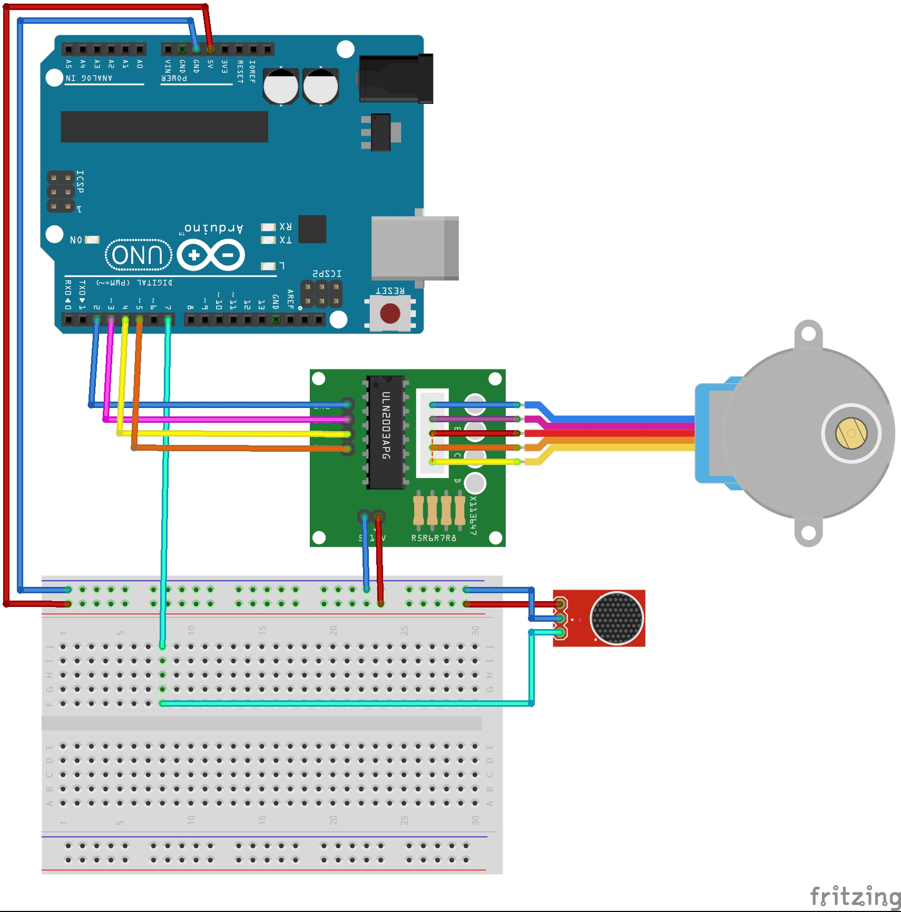

# arduino-stukanie

This project's goal is to stop my cat from waking me up when she hits the blinders at night.

The setup is simple - download the files and open the ino file in the Arduino IDE.

The wiring looks as follows:

